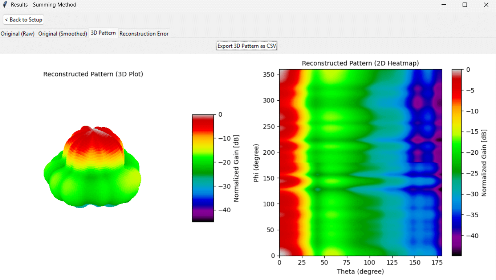
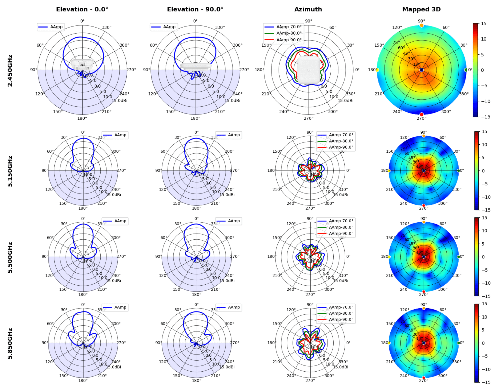
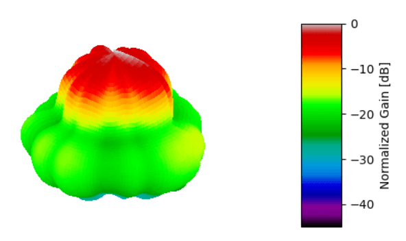
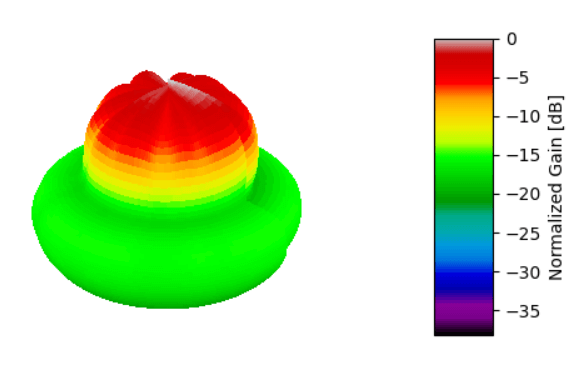
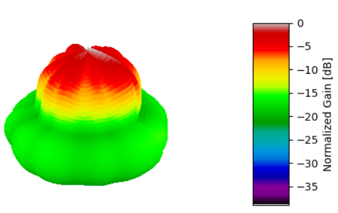
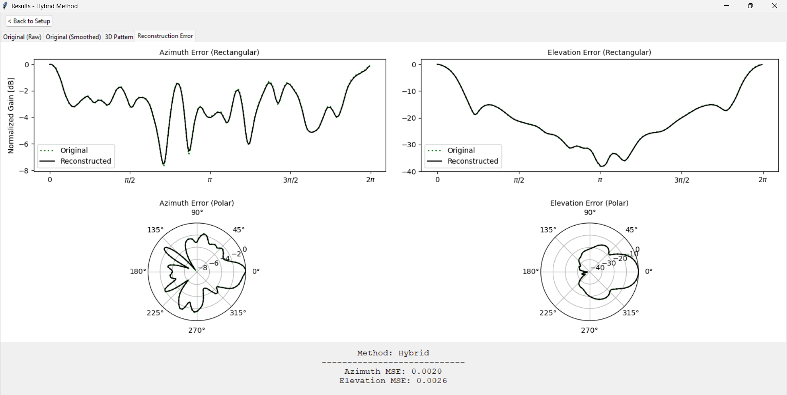

  

    <svg xmlns="http://www.w3.org/2000/svg" width="16" height="16" fill="currentColor" viewBox="0 0 16 16" style="margin-right: 8px; color: black;">
      <path d="M8 0C3.58 0 0 3.58 0 8c0 3.54 2.29 6.53 5.47 7.59.4.07.55-.17.55-.38 0-.19-.01-.82-.01-1.49-2.01.37-2.53-.49-2.69-.94-.09-.23-.48-.94-.82-1.13-.28-.15-.68-.52-.01-.53.63-.01 1.08.58 1.23.82.72 1.21 1.87.87 2.33.66.07-.52.28-.87.51-1.07-1.78-.2-3.64-.89-3.64-3.95 0-.87.31-1.59.82-2.15-.08-.2-.36-1.02.08-2.12 0 0 .67-.21 2.2.82.64-.18 1.32-.27 2-.27.68 0 1.36.09 2 .27 1.53-1.04 2.2-.82 2.2-.82.44 1.1.16 1.92.08 2.12.51.56.82 1.27.82 2.15 0 3.07-1.87 3.75-3.65 3.95.29.25.54.73.54 1.48 0 1.07-.01 1.93-.01 2.2 0 .21.15.46.55.38A8.012 8.012 0 0 0 16 8c0-4.42-3.58-8-8-8z"/>
    </svg>
    <a href="https://github.com/pwm-ii/AntennaPatternInterpolator/" target="_blank" style="text-decoration: none;">
      See Code Here
    </a>
  

> [!info] Requirements
> * **Language:** Python 3.x
> * **Required Libraries:** `numpy`, `scipy`, `matplotlib`, `tkinter`

## Overview

Paul's Interpolation Engine (PIE) is a tool designed to reconstruct the full 3-D radiation pattern $G(\theta, \phi)$ using only the two principal orthogonal cuts: **the azimuth plane** --  ${G}_{\text{az}}(\phi)$ and **the elevation plane** --  ${G}_{\text{el}}(\theta)$. In effect, this tool is an open-source recreation of the function [`patternFromSlices`](https://www.mathworks.com/help/antenna/ref/patternfromslices.html) from MATLAB's Antenna Toolbox.  
* This allows you to reconstruct the full pattern using 720 datapoints (360 Azimuth, 360 Elevation). <b>Doing this by measurement would require around 65,000 datapoints</b>.
* This tool requires ~1% of the required data to function, so there is an obvious tradeoff in accuracy. This is a tool for rapid estimation, not precise calculation.

  <em>Figure 1: PIE graphic user interface. 3D Pattern Window</em>

* $\mathbf{G}_{az}(\phi)$ represents the gain in the azimuthal plane where $\theta$ is fixed as $90^\circ$ or $0^\circ$ depending on mounting.
* $\mathbf{G}_{el}(\theta)$ represents the gain in the elevation plane where $\phi=0^\circ$ for the front hemisphere and $\phi=180^\circ$ for the back.
* Data must be normalized such that the maximum gain equals $0~\text{dB}$ to preserve the integrity of the Summing Algorithm.

The goal of this tool is to aid in rapid visualization of antenna coverage without the time-consuming full-sphere anechoic measurements or computationally expensive 3-D simulations.

```mermaid
graph TD
    A[/"<b>Raw Input Data:</b></b><br/> G<sub>AZ</sub>(&theta;), G<sub>EL</sub>(&phi;)"/] --> B["<b>Preprocessing</b><br/>(Auto-Center, Loop Closure)"]
    B --> C[/"<b>Input Data:</b><br/> G&#771;<sub>AZ</sub>(&theta;), G&#771;<sub>EL</sub>(&phi;)"/]
    C --> D["<b>2D Interpolation</b><br/>(Cubic Spline)"]
    D --> E[/"<b>Smoothed Input Data:</b><br/> G&#770;<sub>AZ</sub>(&theta;), G&#770;<sub>EL</sub>(&phi;)"/]
    E --> F["<b>3D Interpolation</b><br/>(Summing, Approx, Hybrid)"]
    F --> G[/"<b>Raw 3D Pattern:</b><br/> G&#771;(&theta;, &phi;)"/]
    G --> H["<b>Post-Processing</b><br/>(Gaussian Smoothing)"]
    H --> I[/"<b>Output Data:</b><br/> G&#770;(&theta;, &phi;)"/]

    style A fill:#f0f0f0,stroke:#333,stroke-width:2px,color:black
    style C fill:#f0f0f0,stroke:#333,stroke-width:2px,color:black
    style E fill:#f0f0f0,stroke:#333,stroke-width:2px,color:black
    style G fill:#f0f0f0,stroke:#333,stroke-width:2px,color:black
    style I fill:#f0f0f0,stroke:#333,stroke-width:2px,color:black
    
    style B fill:#ffffff,stroke:#000,stroke-width:2px,color:black
    style D fill:#ffffff,stroke:#000,stroke-width:2px,color:black
    style F fill:#ffffff,stroke:#000,stroke-width:2px,color:black
    style H fill:#ffffff,stroke:#000,stroke-width:2px,color:black
```

  <em>Figure 2: Interpolation Flowchart</em>

 

> [!info]- Antenna Data Sources
> When developing this tool, I used antenna patterns provided by UniFi for their commercial Wi-Fi Routers. The specific model I used was the **U7 Outdoor**.
> 
> 

>   
>   
<em>Figure 3: UniFi U7 Outdoor Router</em>

> 

> 
> Contained below are a couple of graphs provided by UniFi for this router [1].
> 
> 

>   
>   
<em>Figure 4: UniFi-provided antenna patterns for the U7 Outdoor Router</em>

> 

> 
> Aside from these graphs, UniFi also provides the data points for their antenna patterns in a `.ant` file:
> * **First 360 values:** Azimuth plane
> * **Next 360 values:** Elevation plane
>
> All 3D patterns on this page are reconstructed using the `.ant` file for a **U7 Router @ 5 GHz**.

## 2D Interpolation

The tool accepts text file inputs (.ant, .txt, .csv) containing a column of gain values (in normalized dB). The only requirements are:
 * The total number of data points is an <b>even</b> number divided equally between azimuth and elevation (top half of file is azimuth data, bottom half is elevation).
 * The total number of data points is at least 10 (Minimum: 5 Azimuth, 5 Elevation).

 Before passing these data points for 3-D interpolation, Cubic Splines are used to map the arbitrary number of input points to a standard 360-point grid at 1-degree resolution.

 

   <em>Figure 5: 2D interpolation using Cubic Splines</em>
 

## 3D Interpolation

The purpose of 3-D interpolation is to take the smoothed input data ($360$ Azimuth + $360$ Elevation $=720$ total) and use this to generate a matrix of $(360 \times 180)$ data points. The tool implements three different 3-D interpolation algorithms to handle situations of varying complexity:

## Summing Algorithm

> 

  <em>Figure 6: 3-D radiation pattern reconstructed using the Summing Algorithm</em>

The first method is the Summing Algorithm [3, p.1]. This approach adds the logarithmic (dB) gain elevation and azimuth patterns. This is mathematically equivalent to multiplying the linear gain patterns.

$$
{G}_{\text{sum}}(\theta, \phi) = G_{\text{az}}(\phi) + G_{\text{el}}(\theta) \ [dB]
$$

* This method can perfectly reconstruct omni-directional patterns (e.g., dipoles) with no error due to their inherent axial symmetry [2,p.2].
* The Summing method is effective at reconstructing the main lobe of directive antennas but interpolation can fail with side lobes.
* Summing <u>systematically underestimates gain</u> in complex directional antennas. This can be good if you want a conservative estimate.
* Summing can introduce artifacts ("creases") at the intersection of the principal cuts.

 

## Approximation Algorithm

>

  <em>Figure 7: 3-D radiation pattern reconstructed using the Approximation Algorithm</em>

The Approximation Algorithm is a variation on summing which introduces geometric cross-weighting. This means that the magnitude of the azimuthal cut is used to weigh the contribution of the elevation cut and vice versa. Or in other words, one of the principal planar cuts is related to its orthogonal pair as a function of its normalized linear magnitude. This approach addresses the inherent weakness of summing with reconstructing side lobes.

At an arbitrary point $(\theta, \phi)$, the approximated antenna gain is [2, p.2-3]:

$$
{G}_{\text{app}}(\theta, \phi) = \frac{G_{\text{az}}(\phi) \cdot w_1 + G_{\text{el}}(\theta) \cdot w_2}{\sqrt[k]{w_1^k + w_2^k}}
$$

where $k$ is the normalization parameter (discussed later) and the weight functions $w_1$ and $w_2$ are given by:

$$
\begin{aligned}
w_1(\phi, \theta) &= \text{vert}(\theta) \cdot [1 - \text{hor}(\phi)] \\
w_2(\phi, \theta) &= \text{hor}(\phi) \cdot [1 - \text{vert}(\theta)].
\end{aligned}
$$

where the linear gain terms are derived from the logarithmic input patterns:

$$
\begin{aligned}
\text{hor}(\phi) &= 10^{G_{\text{az}}(\phi)/10} \\
\\ 
\text{vert}(\theta) &= 10^{G_{\text{el}}(\theta)/10}
\end{aligned}
$$

If we define $A_1$ and $A_2$ as the overall normalized weights:

$$
\begin{aligned}
{G}_{\text{app}}(\theta, \phi) &= \left[ G_{\text{az}}(\phi) \cdot \frac{w_1}{\sqrt[k]{w_1^k + w_2^k}} \right] + \left[ G_{\text{el}}(\theta) \cdot \frac{w_2}{\sqrt[k]{w_1^k + w_2^k}} \right] \\
\\
&= G_{\text{az}}(\phi) \cdot A_1 + G_{\text{el}}(\theta) \cdot A_2
\end{aligned}
$$

then the initial weights are normalized such that the following relationship is satisfied:

$$
A_1^k + A_2^k = 1.
$$

* This method generally produces <u>more optimistic (higher gain) estimates</u> than summing while retaining more side-lobe detail. 
* Like summing, when the antenna pattern is axially symmetric, no error is produced from interpolation.
* The overall normalized weights, $A_1$ and $A_2$, define the participation of each slice in the interpolation. When $A_1 = 1$ and $A_2 = 1$, the Approximation and Summing Algorithms are equivalent.

Interpolation is governed by the <b>normalization parameter ($k$)</b>, which controls the mathematical locus of the weights. Increasing k produces a more conservative (lower gain) estimate.
* **$k=1$**: Applies standard linear weighting.
* **$k=2$** (Default): Minimizes approximation error for standard directional antennas [2,p.3].
* **$k \to \infty$**: The behavior converges to the Summing Algorithm.

 

## Hybrid Algorithm

>

  <em>Figure 8: 3-D radiation pattern reconstructed using the Hybrid Algorithm</em>

The Hybrid Algorithm [2, p.2] is a weighted mix that uses the Summing algorithm for the main lobe (where it is most accurate) and the approximation algorithm for the side lobes. This approach works by increasing or decreasing the weight of the two algorithms based on angular distance.

$$
G_{\text{hyb}}(\theta, \phi) = [G_{\text{sum}}(\phi, \theta) \cdot w_3] + [{G}_{\text{app}}(\theta, \phi) \cdot (1 - w_3)]
$$

where:

$$
w_3(\theta, \phi) = \sqrt[n]{\text{hor}(\phi) \cdot \text{vert}(\theta)}
$$

* The hybrid algorithm is optimal for radiation patterns of directive arrays with complex principal patterns.
* The <b>transition slope parameter (n)</b>: Controls the "slope" of the bridging function between the two algorithms.
    * increasing n increases the dominance of the Summing Algorithm. This improves main lobe accuracy but may degrade mean error in side lobes.
* Recommended Range for n is around $3.5$ to $6.0$ but ultimately depends on the directivity of the antenna under test [2 p.4].
    * Yagi-Uda Arrays: Optimal $n \approx 3.5$
    * Panel Antennas: Optimal $n \approx 5.0$

 

## Evaluation of Error

For the UniFi antennas, I did not have the full 3-D pattern available to me, only the principal cuts. So 3-D interpolation error was found by comparing the original principal planes with cuts made from the reconstructed 3-D pattern. 

$$
\text{Error}_{\text{az}} = G_{\text{az}}(\phi) - \hat{G}(\phi, \theta = \frac{\pi}{2})
$$

$$
\text{Error}_{\text{el}} = 
\begin{cases} 
G_{\text{el}}(\theta) - \hat{G}(\theta, \phi=0) & 0 \le \theta < \pi \\
G_{\text{el}}(\theta) - \hat{G}(\theta, \phi=\pi) & \pi \le \theta < 2\pi 
\end{cases}
$$

This produces a graph which looks like:

  <em>Figure 9: Error comparison between original principal planes and reconstructed pattern cuts</em>

> [!WARNING]
> **This is a non-rigorous approach to calculating error**! While useful, cases may exist where an interpolation method has greater error in the principal slices while having less error in the interpolated 3-D pattern overall (or vice versa). The optimal way to calculate 3-D interpolation error would be finding the difference between the original 3-D antenna pattern and the pattern reconstructed from the principal planes.  
> $$
> \text{Error}= \left| G(\theta, \phi) - \hat{G}(\theta, \phi) \right|
> $$
>
> > [!Success] Note: Using a different antenna pattern, I went back and [[CalculatingTotalError|calculated total error here]] using the optimal method.

## References

[1]  "AP Antenna Radiation Patterns," UniFi, March. 1, 2023. [Online]. Available: https://help.ui.com/hc/en-us/articles/115005212927-AP-Antenna-Radiation-Patterns  

[2] T. G. Vasiliadis, A. G. Dimitriou and G. D. Sergiadis, "A novel technique for the approximation of 3-D antenna radiation patterns," in IEEE Transactions on Antennas and Propagation, vol. 53, no. 7, pp. 2212-2219, July 2005.

[3] N. R. Leonor, R. F. S. Caldeirinha, M. G. Sánchez and T. R. Fernandes, "A Three-Dimensional Directive Antenna Pattern Interpolation Method," in IEEE Antennas and Wireless Propagation Letters, vol. 15, pp. 881-884, 2016.