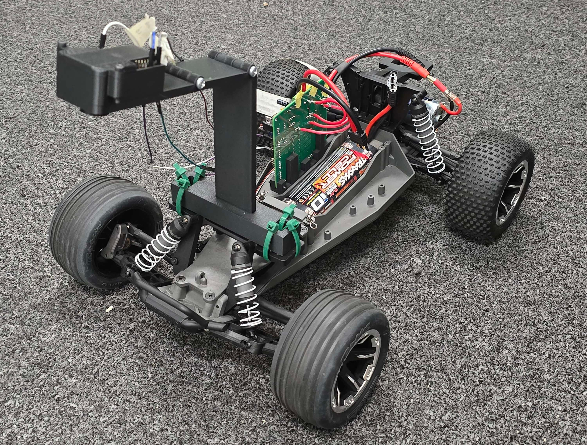
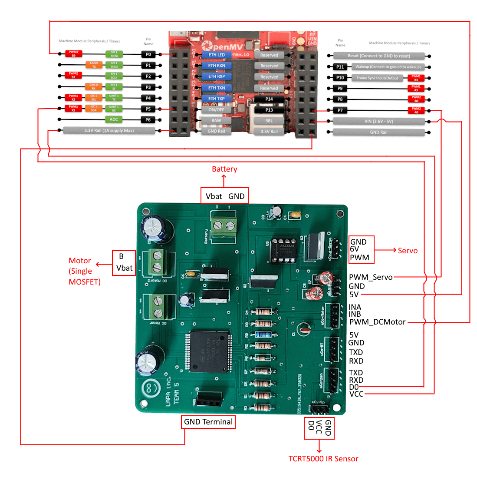
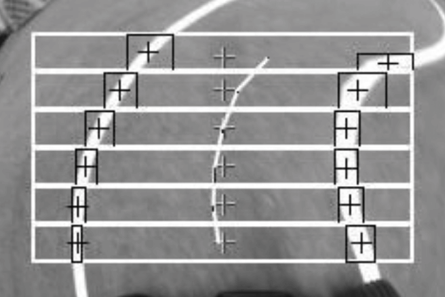
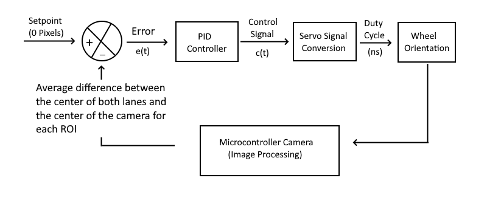
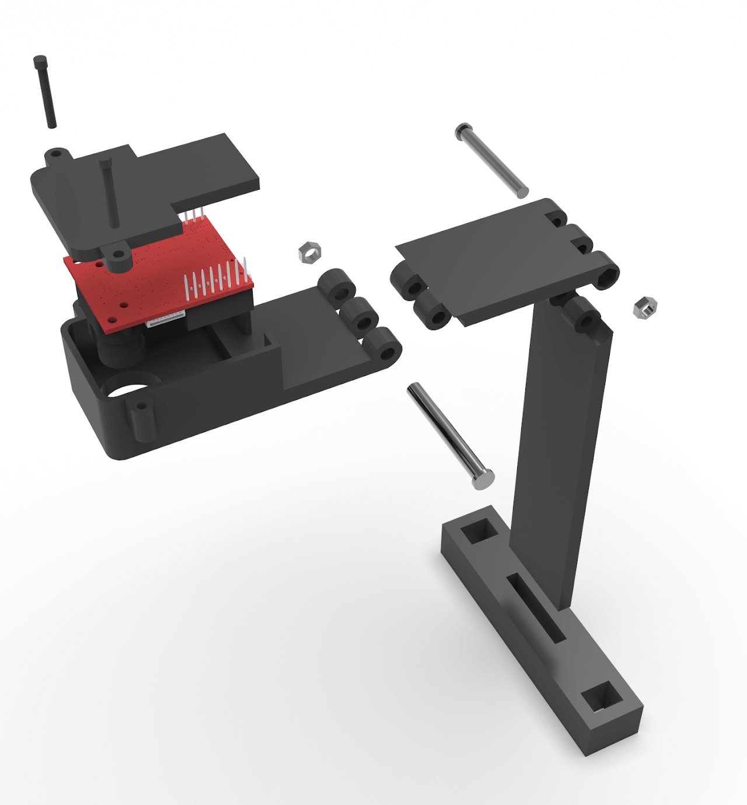
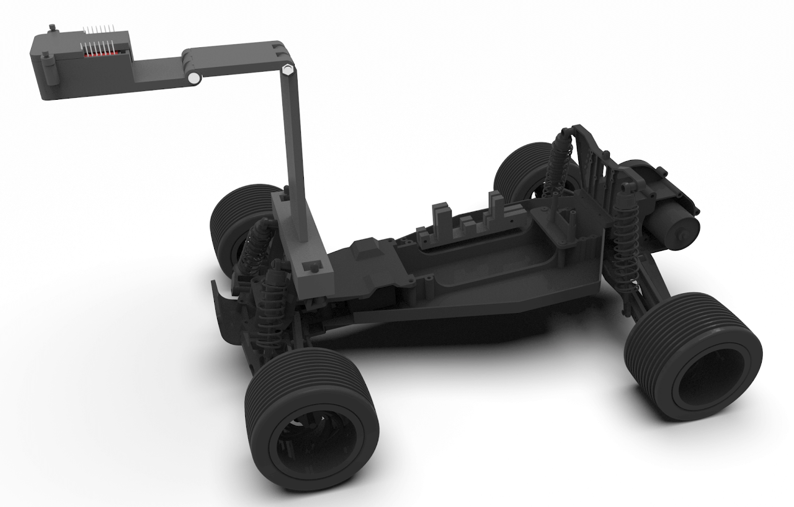

  

  <em>Figure 1: Autonomous Lane-Following Car</em>

## Overview
For my undergraduate Senior Design Project (<i>EEC 195AB - Winter/Spring Quarter 2025</i>), my team and I set out to design an Autonomous Lane-Following Car. This car completed a multi-room circuit while staying between two white lanes.

**Team**: [Paul Mola (Me)](https://www.linkedin.com/in/paulwmola-ii/), [Alexander Rexelle](https://www.linkedin.com/in/rexelle/), [Allan Rotich](https://www.linkedin.com/in/allan-rotich-3a12ab258/), [Luca Caniglia](https://www.linkedin.com/in/luca-caniglia-59300015a/)

  <iframe 
    width="560" 
    height="315" 
    src="https://www.youtube-nocookie.com/embed/FCBzzya6A4A?si=JtHXrhgWlkxcqkjq&vq=hd720" 
    title="YouTube video player" 
    frameborder="0" 
    allow="accelerometer; autoplay; clipboard-write; encrypted-media; gyroscope; picture-in-picture; web-share" 
    referrerpolicy="strict-origin-when-cross-origin" 
    allowfullscreen>
  </iframe>

  <em>Video 1: Demonstration of PID control</em>

The team started with an existing chassis which came equipped with a servo and DC motor from the original equipment manufacturer. Lane following was implemented using closed-loop PID control driven by visual feedback. 
* The system used an OpenMV microcontroller + camera for real-time image processing to detect lane boundaries and serve as the controller's feedback element.
* A custom-designed PCB managed all electronic connections between the OEM parts, the microcontroller, and the battery.
* Custom-designed 3D-printed housings and mounts were used to secure all components to the chassis.

## Electrical Design

  

  <em> Figure 2: PCB Connection Diagram. Own Work</em>

To manage all electrical connections between the system modules (servo, battery, microcontroller, and infrared sensor), we created a custom PCB. The PCB was also used to implement two distinct motor control circuits:
* The first method used an H-Bridge integrated circuit (VNH5019ATR-E), which incorporated reverse battery protection [5, pp. 15-16]. 
* The second method employed a MOSFET (IRF3205PBF) driven by a MAX4427CPA+ gate driver chip to boost the servo PWM signal to 5V logic. 

The board also featured two (low-dropout) voltage regulation circuits:
* One provided 5V of power for the microcontroller (LM2940CT-5.0).
* The other provided 6V of power for the servo (LM1086CT-ADJ).

## Computer Vision and Control

The car's steering was adjusted using visual feedback from the microcontroller's camera. We did this by configuring the camera in grayscale mode with a resolution of 240 × 160 (HQVGA) and having it take periodic images of the track. 
* In each image, we defined six horizontal regions of interest (ROIs) spaced vertically across the image, each 200 × 20 pixels in size (see: the white rectangles in the figure). 
* Within each ROI, we used blob detection to locate areas that differed from their surrounding regions based on the level of brightness. After filtering the detected blobs to exclude those with an area less than 100 or greater than 350 pixels, we selected the two closest objects to the image center from the left and right (see: smaller black rectangles in the figure). 

Once we found this, we were able to calculate the horizontal error between the center of the two white lanes (see: white line in the middle of the track) and the center of the image (see: crosses in the middle of the screen).

  

  <em>Figure 3: Steering Horizontal Error Visualization</em>

This horizontal error is what was being fed back as an input to control the steering. A PID controller continuously determined the required correction based on the difference between the desired setpoint (0 pixels) and the horizontal error computed by the OpenMV. Since the horizontal error was being calculated for each of the different ROIs, the error was averaged before being compared to the setpoint. 

  

  <em>Figure 4: Control System Model of Car Steering. Own Work</em>

The continuous-time PID control equation is:

$$
c(t) = K_p \cdot e(t) + K_i \cdot \int e(t) \, dt + K_d \cdot \frac{de(t)}{dt}
$$

Where:
* $e(t) = \text{setpoint} - \text{horizontal error}(t)$
* $K_p:$ Proportional gain
* $K_i:$ Integral gain
* $K_d:$ Derivative gain

However, to implement the continuous-time equation above in code, it was necessary to use discrete-time steps:

$$
c(t)= K_p \cdot e(t) + K_i \cdot \left[\sum_{t=0}^{n} e(t) \cdot \Delta t\right] + K_d \cdot \left[\frac{e(t) - e(t-1)}{\Delta t}\right]
$$

* The magnitude of the integral term was clamped as an anti-windup measure.
* The proportional gain was dynamically tuned based on the horizontal error.
* The steering was handled by subtracting the control signal from the neutral servo pulse width value (in nanoseconds).

  

    <svg xmlns="http://www.w3.org/2000/svg" width="16" height="16" fill="currentColor" viewBox="0 0 16 16" style="margin-right: 8px; color: black;">
      <path d="M8 0C3.58 0 0 3.58 0 8c0 3.54 2.29 6.53 5.47 7.59.4.07.55-.17.55-.38 0-.19-.01-.82-.01-1.49-2.01.37-2.53-.49-2.69-.94-.09-.23-.48-.94-.82-1.13-.28-.15-.68-.52-.01-.53.63-.01 1.08.58 1.23.82.72 1.21 1.87.87 2.33.66.07-.52.28-.87.51-1.07-1.78-.2-3.64-.89-3.64-3.95 0-.87.31-1.59.82-2.15-.08-.2-.36-1.02.08-2.12 0 0 .67-.21 2.2.82.64-.18 1.32-.27 2-.27.68 0 1.36.09 2 .27 1.53-1.04 2.2-.82 2.2-.82.44 1.1.16 1.92.08 2.12.51.56.82 1.27.82 2.15 0 3.07-1.87 3.75-3.65 3.95.29.25.54.73.54 1.48 0 1.07-.01 1.93-.01 2.2 0 .21.15.46.55.38A8.012 8.012 0 0 0 16 8c0-4.42-3.58-8-8-8z"/>
    </svg>
    <a href="https://github.com/pwm-ii/LaneFollowing/" target="_blank" style="text-decoration: none;">
      See Code Here
    </a>
  

## Mechanical Design

To mount the various components, such as the microcontroller, sensors, and PCB, to the OEM chassis, we created a number of custom 3D-printed housings.

  

  <em>Figure 5: Custom 3D-printed microcontroller housing</em>

  

  <em>Figure 6: Custom 3D-printed parts on OEM vehicle chassis</em>

## References

[1] Analog Devices, MAX4427CPA+ Datasheet, Rev. 2, Analog Devices, Inc., 2014. [Online]. Available: https://www.analog.com/media/en/technical-documentation/data-sheets/MAX4426-MAX4428.pdf

[2] L. Halsted, EEC 195A - Autonomous Vehicle Design Project [Lecture Notes], 2025.

[3] Infineon Technologies, IRF3205PBF Datasheet, International Rectifier, 2005. [Online]. Available: https://www.infineon.com/dgdl/irf3205pbf.pdf?fileId=5546d462533600a4015355def244190a 

[4] OpenMV, "Quick reference for the OpenMV Cam," OpenMV Documentation. [Online]. Available: https://docs.openmv.io/openmvcam/quickref.html

[5] STMicroelectronics, VNH5019ATR-E H-Bridge IC Datasheet, STMicroelectronics, 2020. [Online]. Available: https://www.st.com/resource/en/datasheet/vnh5019a-e.pdf  

[6] Texas Instruments, LM1086CT-ADJ Datasheet, Texas Instruments. [Online]. Available: https://www.ti.com/lit/ds/symlink/lm1086.pdf

[7] Texas Instruments, LM2940CT-5.0 Datasheet, Texas Instruments, 2016. [Online]. Available: https://www.ti.com/lit/ds/symlink/lm2940-n.pdf  

[8] Traxxas, Rustler Model 37054 Owner's Manual, Traxxas, LLC. [Online]. Available: https://traxxas.com/media/productattach/C-24054-8/2/24054-36054-37054-8-om-en-r00.pdf