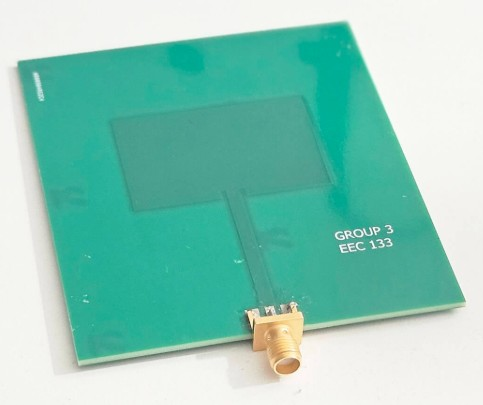
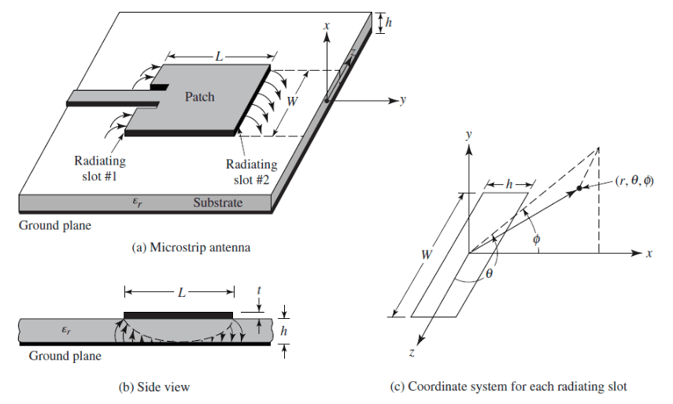
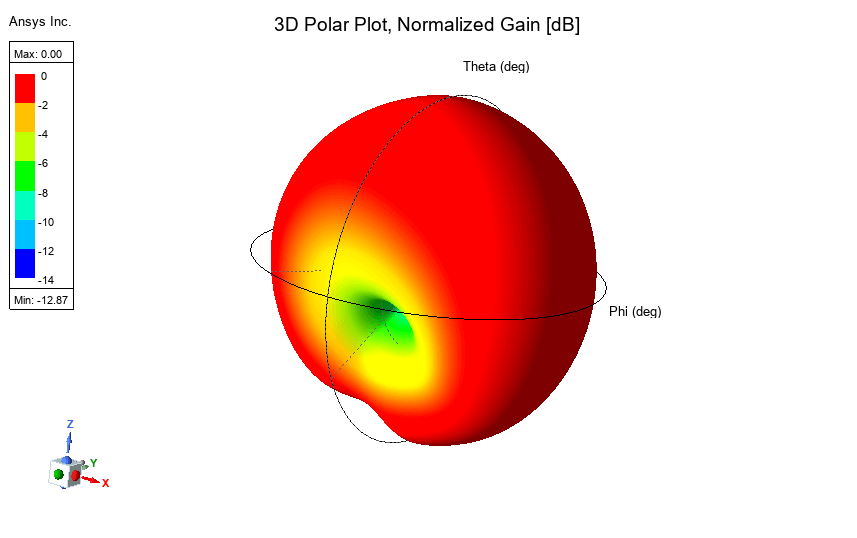
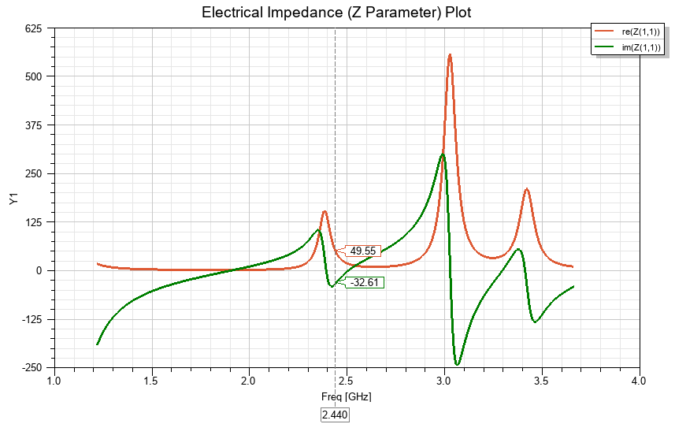
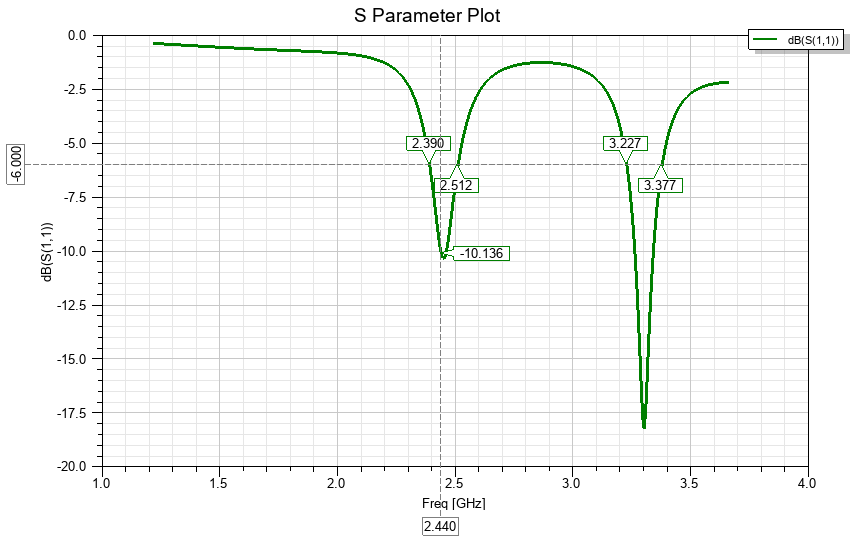
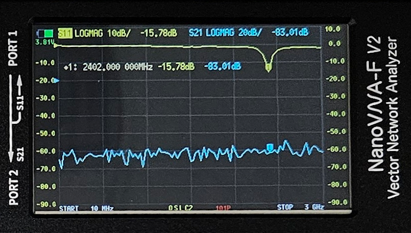

  

    
    

      <em>Figure 1: Fabricated Patch Antenna</em>
    

  

  
  

    
    

      <em>Figure 2: Simulated Patch Antenna, Exported from HFSS</em>
    

  

## Overview
For the final project in my Antenna Theory course (<i>EEC 133 - Fall Quarter 2024</i>), I was tasked with designing a patch microstrip antenna which operated within the Bluetooth frequency band (2.402–2.480 GHz). This project could be split roughly into three phases: calculation, simulation, and validation.
* Patch antennas are generally defined by their low profile, which is useful in cases where weight and size are restrictions. However, they are also known to exhibit comparatively poor efficiency, power, scan performance, polarization purity, and notoriously narrow bandwidth [1, p. 783].

  <em>Figure 3: Patch antenna geometry [1, p.723]</em>

## Initial Calculations
My first step in designing the antenna was to use the design parameters to determine some of the physical dimensions. <i>Starting with a set of provided parameters</i> (Resonant Frequency: $2.44~\text{GHz}$, Return Loss: $> 10~\text{dB}$, Relative Permittivity $\varepsilon_r = 4.5$, Dielectric Thickness: $1.6~\text{mm}$, Copper Thickness: $17~\mu\text{m}$, Feed Impedance: $50~\Omega$), I calculated the basic microstrip geometry:

* In the dominant transverse-magnetic (TM) mode, the resonant frequency of the antenna is a function of its length. This relationship can be used to obtain L and W [1, p. 790].

$$
(f_r)_{m,n} = 2.44 \times 10^9 = \frac{c}{2\sqrt{\varepsilon_r}}\sqrt{\left(\frac{m}{L}\right)^2 + \left(\frac{n}{W}\right)^2}
$$

For the case $(m, n) = (1, 0)$:

$$
L = \frac{c}{2(f_r)\sqrt{4.5}} = \frac{3 \times 10^8}{2(2.44 \times 10^9)\sqrt{4.5}} = 28.04~\text{mm}
$$

For the case $(m, n) = (0, 1)$:

$$
W \approx 1.5L = 42.06~\text{mm}
$$

* After the following calculations, I used the <b>Cadence TX-LINE Calculator</b> to determine the approximate dimensions for an inset feed to match the patch antenna to a 50-ohm transmission line.
* Once I had these values, I simulated them on HFSS (see next section), and iteratively obtained a set of final values:
$$
\underline{\textbf{Final Values:}} \quad L = 27.9~\text{mm} , \ W = 1.5L = 41.85~\text{mm}, \ L_{\text{feed}} = 33.14~\text{mm}
$$

## Simulation
Using the initial calculated geometry, I simulated the antenna performance with HFSS. This step was used to iteratively refine the calculated values before fabrication. The images below pertain to the final values.

  <em>Figure x: 3D Polar Plot, Normalized Gain. Exported from HFSS</em>

  

    
    

      <em>Figure 8: Simulated resistance and reactance. Exported from HFSS</em>
    

  

  
  

    
    

      <em>Figure 9: Return loss. Exported from HFSS</em>
    

  

  <em>Figure 10:  Table of various parameters.  Exported from HFSS</em>

## Validation
Lastly, once the physical antenna was fabricated, it was necessary to evaluate the design. This was done by using a vector network analyzer (VNA) to measure the scattering parameters. Displayed below is the result for S(11), the input return loss. Note: Disregard S(21). Nothing was connected to port 2 so noise is being displayed.

  <em>Figure 11:  Measured input return loss</em>

In conclusion, the project can be considered successful. Both the simulated and measured return loss was above the required design threshold of 10 dB, with values of 10.14 dB and 15.78 dB, respectively.

## References

[1] C. A. Balanis, "Microstrip Antennas," in Antenna Theory: Analysis and Design, 2nd ed., Hoboken, NJ, USA: Wiley, 1997, ch. 14.

[2] R. C. Johnson and H. Jasik, "Microstrip Antennas," in Antenna Engineering Handbook, 2nd ed., New York, NY, USA: McGraw-Hill, 1984, ch. 7.